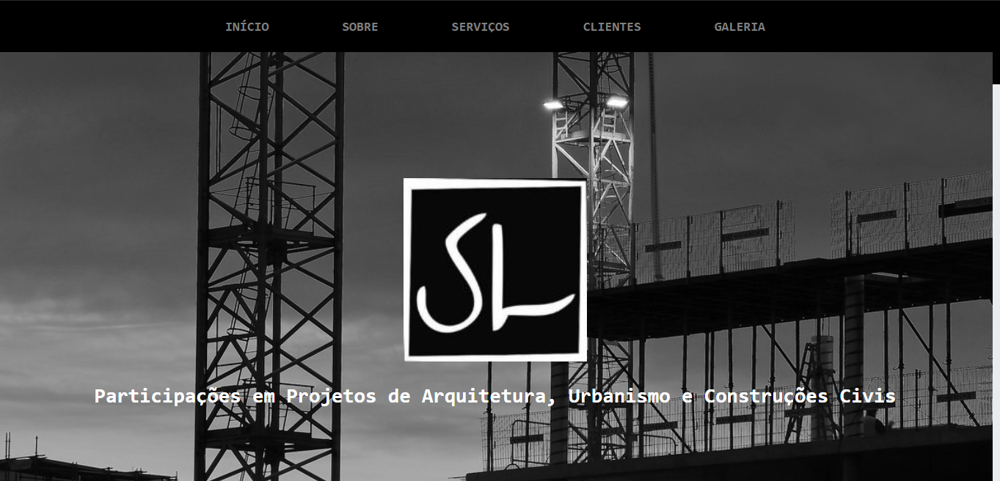
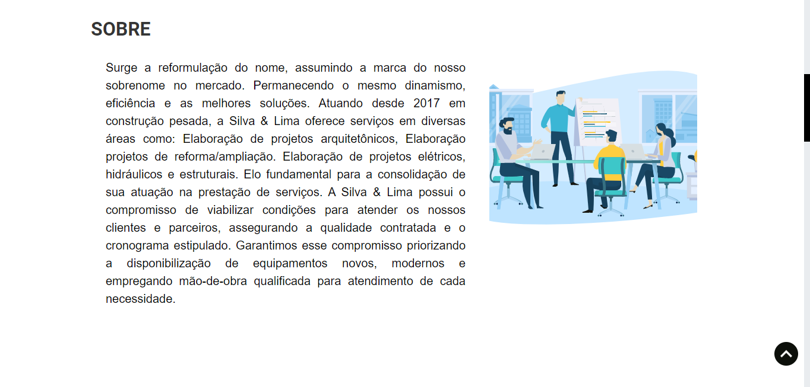

# :calling: Projeto inicial do Site Silva e Lima :computer:

Este Projeto contém a estrutura inicial do site da empresa de construção civil Silva e Lima.
Por solicitação do cliente, o site possui uma página única que contém a descrição, áreas de atuação, Clientes, galeria e redes sociais de comunicação.

O primeiro snippet do site contém a barra de menus que direciona o usuário para a região e, além disso, possui a logomarca com uma animação estruturada utilizando Framer Motion. 

O segundo bloco apresenta a descrição da empresa ao usuário. Além disso, contém uma animação de aparência que é ativada quando a pessoa rola a tela além de 150px da tela do seu pc. No canto inferior direito tem um botão que direciona o usuário para o início da página.

Um ponto importante solicitado pelo cliente foi um botão que direcione para o Whatsap, Instagram e E-mail.